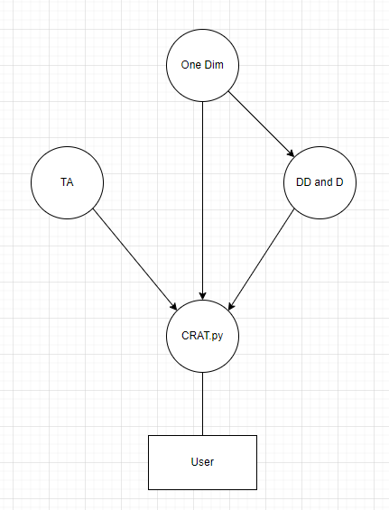

# Code structure and where to look for normalization implementation

This is meant to be a temporary file to guide you on how the code is structured amoung other things


Above is a loose depection of the dependany graph of this project. (DD and D stand for dataDate.py, dataDates.py, and detectors.py) The user interacts with only the CRAT.py file. This file manages all of the other class interactions and nothing else. This makes testing and writing new functionality much easier in the long run.

## Implementing
If you look the the CRAT.py file, you will find lots of simplistic functions, such as _oneD(). These are essentially driver functions. They are meant to perform whatever the user wants at a high level. For example, if we wanted functionality for adding two complex numbers, this file would not actually add them. All it would do is call another function, built in a seperate class, to add them. This is because, most times, you need to do multiple simple steps, such as get the data, parse through it, operate on/with it, then print it out. You will also see a lot of _des_something functions. These functions were a quick band-aid solution to offering helpful descriptions for commands for users.

In order to implement your own code, (assuming you have already wrritten the lower level code in a class or function already) you will have to import it into CRAT.py (look at lines 12 - 15 in CRAT.py as well as the ```__init__.py``` files for examples on how to do this, I made it as straight forward as I could and it is pretty self explanatory). After this, write your own high level function using your lower level functions or classes. Finally, add your command and function into the _commands dic on line 26-35.

## Writting low level for normalization
To write the low level code is on a very case-by-case basis in general. This, however, will point you in the direction of how to get to the normalization code I have already outlined. Go into the OneDimension/oneDimDisplay.py file and look for the function plotLv0vsTemp(). This is essentially the normalization function. It is commented out for you to follow. Note that the majority of it is matplotlib setup and cleaning up the data given a bit, so you really wont need to touch most of it at all, only the section under the "# THIS IS THE NORMALIZATION PROCESS THAT WILL NEED TO BE CHANGED" comment

### A Note
This codebase follows the OOP principles... somewhat. There is a lot I would change now, and it is really far from perfect, but was made with quick, short-term development in mind. This is why there is one class to deal with user input and high level ideas and everything else is essentially written as is. Moving forward, if this codebase is used to write a lot more code with more than 2 people, I strongly suggest refactoring nearly everything so that continued support is possible.